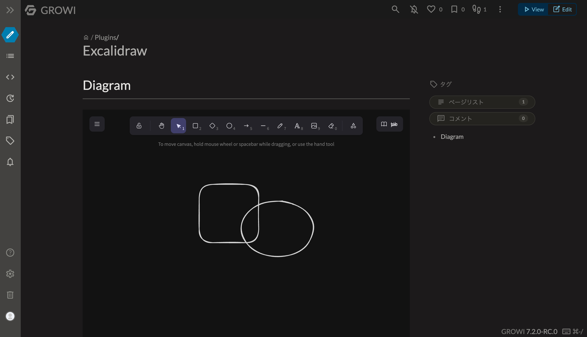

# GROIW Excalidraw Plugin

This is a plugin for GROWI that allows you to embed [Excalidraw](https://excalidraw.com/) diagrams.



## Usage

```markdown
:::excalidraw[ID]{theme=dark size=600px}
{
  // Excalidraw JSON
}
:::
```

At first, you should start this plugin like below.

```markdown
:::excalidraw[ID]{theme=dark size=600px}
:::
```

After saved the page, you can edit the diagram in view page.

### Options

- ID: A unique identifier for the diagram. It's required.
- theme: The theme of the diagram. Default is light.
- size: The size of the diagram. Default is 500px.

## Limitations

- 1 diagram per page
- Diagrams are not editable in edit mode
- You will get the conflict when you edit the page after editing the diagram. This is because GROWI retains the data on the display screen when editing. This plugin updates the page content in the background. When editing the page content, please reload the editing screen once.
- This plugin will save the page after 2 seconds if you do not do anything after updating the drawing. This is because the onChange event of Excalidraw is called very frequently.

## License

MIT
